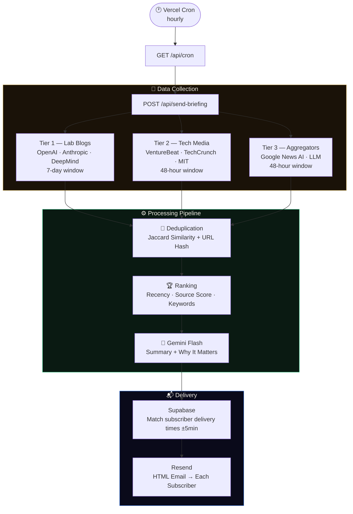

<div align="center">

<!-- Animated Banner -->


<!-- Animated Typing -->
<a href="https://github.com/professyzenith/XanthraHorizon">
  
</a>

<br/>

<!-- Core Badges -->
<p>
  <a href="https://nextjs.org"></a>
  <a href="https://www.typescriptlang.org"></a>
  <a href="https://supabase.com"></a>
  <a href="https://resend.com"></a>
  <a href="https://aistudio.google.com"></a>
  <a href="https://vercel.com"></a>
</p>

<!-- Status Badges -->
<p>
  
  
  
  
</p>

<br/>

> **A premium daily AI intelligence platform.**  
> Fetches, deduplicates, ranks, and summarizes the most important AI developments — then delivers a beautiful briefing to your subscribers' inboxes at exactly the time they choose.

<br/>

</div>

---

## What It Does

Every day, Xanthra Horizon runs a fully automated intelligence pipeline:

```
Fetch (8 sources) → Deduplicate → Rank → AI Summarize → Email Delivery
```

No noise. No irrelevant articles. Just the top AI developments that actually matter — explained clearly, delivered on time.

---

## Features

| | Feature | Detail |
|---|---|---|
| 🗞️ | **8 Live Sources** | OpenAI Blog, Anthropic, DeepMind, VentureBeat, TechCrunch, MIT Tech Review, Google News |
| 🧠 | **AI Summarization** | Gemini Flash generates concise summaries + "Why It Matters" for each story |
| ⏰ | **Timezone-Aware Delivery** | Each subscriber picks their own delivery time — matched globally via cron |
| 🔁 | **Smart Deduplication** | Jaccard similarity + URL hash dedup — same story never appears twice |
| 🏆 | **Relevance Ranking** | Scores by source tier, recency decay, and AI keyword density |
| 🔒 | **Production Secure** | Row Level Security on Supabase · CRON_SECRET on pipeline endpoint |
| 📤 | **One-Click Unsubscribe** | CAN-SPAM compliant — confirmation page included |
| 🆓 | **Zero Cost** | Runs entirely on free tiers — ₹0/month |

---

## Architecture



---

## Tech Stack

<details>
<summary><b>View full stack breakdown</b></summary>

<br/>

| Layer | Technology | Why |
|---|---|---|
| **Framework** | Next.js 14 App Router | API routes + SSR in one project |
| **Language** | TypeScript 5 (strict) | Type safety across the full pipeline |
| **Styling** | Tailwind CSS | Utility-first, no runtime cost |
| **Database** | Supabase (PostgreSQL) | Free tier · RLS · Real-time ready |
| **Email** | Resend | 3,000 emails/month free · React-friendly |
| **AI** | Google Gemini Flash | 1,500 req/day free · Fast inference |
| **Hosting** | Vercel Hobby | Zero-config Next.js · Edge-ready |
| **Cron** | Vercel Cron / cron-job.org | Hourly scheduling at no cost |

</details>

---

## Project Structure

```
xanthra-horizon/
│
├── app/
│   ├── api/
│   │   ├── cron/             → GET  /api/cron           Vercel Cron trigger
│   │   ├── send-briefing/    → POST /api/send-briefing  Full pipeline
│   │   ├── subscribe/        → POST /api/subscribe      Subscriber signup
│   │   ├── unsubscribe/      → GET  /api/unsubscribe    Deactivate subscriber
│   │   ├── test-pipeline/    → GET  /api/test-pipeline  Dry-run (no emails)
│   │   └── status/           → GET  /api/status         Env key health check
│   │
│   ├── unsubscribe/          → Confirmation page
│   ├── globals.css
│   ├── layout.tsx            → Metadata + fonts
│   └── page.tsx              → Landing page
│
├── components/               → UI components (all client-side)
│
├── lib/
│   ├── newsFetcher.ts        → 8-source RSS pipeline
│   ├── deduplicator.ts       → Jaccard + hash deduplication
│   ├── ranker.ts             → Article scoring engine
│   ├── summarizer.ts         → Gemini Flash integration
│   ├── emailSender.ts        → Resend HTML email delivery
│   └── supabase.ts           → Anon + Admin clients
│
├── supabase/
│   └── schema.sql            → Run once to set up tables + RLS
│
├── types/index.ts            → Shared TypeScript interfaces
├── vercel.json               → Hourly cron schedule
└── .env.example              → Environment variable template
```

---

## Getting Started

<details>
<summary><b>Prerequisites</b></summary>

- Node.js 18+
- [Supabase](https://supabase.com) account (free)
- [Resend](https://resend.com) account (free)
- [Google AI Studio](https://aistudio.google.com) API key (free)

</details>

### 1 — Clone

```bash
git clone https://github.com/professyzenith/XanthraHorizon.git
cd XanthraHorizon
npm install
```

### 2 — Set Up Supabase

1. Create a project → **Settings → API** → copy your keys
2. Open **SQL Editor** → paste `supabase/schema.sql` → **Run**

### 3 — Configure Environment

```bash
cp .env.example .env.local
```

```env
# Supabase
NEXT_PUBLIC_SUPABASE_URL=https://your-project.supabase.co
NEXT_PUBLIC_SUPABASE_ANON_KEY=your-anon-key
SUPABASE_SERVICE_ROLE_KEY=your-service-role-key

# Resend (resend.com)
RESEND_API_KEY=re_your_key
RESEND_FROM_EMAIL=hello@yourdomain.com

# Gemini (aistudio.google.com)
GEMINI_API_KEY=your-gemini-key

# Security
CRON_SECRET=your-random-32-char-string

# App
NEXT_PUBLIC_APP_URL=http://localhost:3000
```

### 4 — Run

```bash
npm run dev
```

Check your setup: [`http://localhost:3000/api/status`](http://localhost:3000/api/status)

---

## API Reference

<details>
<summary><b>View all endpoints</b></summary>

<br/>

| Endpoint | Method | Auth | Description |
|---|---|---|---|
| `/api/subscribe` | `POST` | None | Subscribe a new email address |
| `/api/unsubscribe` | `GET` | None | Deactivate subscriber (via email link) |
| `/api/send-briefing` | `POST` | `CRON_SECRET` | Run full pipeline + send emails |
| `/api/cron` | `GET` | Vercel | Called hourly by Vercel Cron |
| `/api/test-pipeline` | `GET` | `CRON_SECRET` | Dry-run pipeline (no emails sent) |
| `/api/status` | `GET` | None | Check which env keys are configured |

**Test the pipeline without sending emails:**
```bash
curl "http://localhost:3000/api/test-pipeline?skip_ai=1" \
  -H "Authorization: Bearer YOUR_CRON_SECRET"
```

</details>

---

## Deployment

<details>
<summary><b>Deploy to Vercel (recommended)</b></summary>

<br/>

1. Push to GitHub
2. Import project at [vercel.com](https://vercel.com/new)
3. Add all environment variables from `.env.local`
4. Change `NEXT_PUBLIC_APP_URL` to your Vercel URL
5. Deploy

The `vercel.json` cron runs automatically on Vercel Pro. For Hobby plan, use [cron-job.org](https://cron-job.org) (free) to POST to `/api/send-briefing` every hour with your `Authorization` header.

</details>

---

## News Sources

<details>
<summary><b>View all 8 sources</b></summary>

<br/>

| Source | Tier | Window | Type |
|---|---|---|---|
| OpenAI Blog | Primary | 7 days | Official announcements |
| Anthropic Blog | Primary | 7 days | Research + safety |
| Google DeepMind | Primary | 7 days | Research + releases |
| VentureBeat AI | Media | 48h | Startup + business news |
| TechCrunch AI | Media | 48h | Product + funding news |
| MIT Tech Review | Media | 48h | Research coverage |
| Google News — AI | Aggregator | 48h | Broad AI landscape |
| Google News — LLM | Aggregator | 48h | LLM-specific coverage |

Tier 1 (official lab blogs) use a 7-day window because they post weekly. Tier 2 uses 48h for freshness.

</details>

---

## Roadmap

- [ ] Web subscriber dashboard (manage delivery time + timezone)
- [ ] Weekly digest mode
- [ ] Topic filtering (subscribe to specific AI categories)
- [ ] RSS output of Xanthra Horizon editions
- [ ] GitHub Actions alternative cron (for Vercel Hobby users)
- [ ] Open Graph preview cards per edition
- [ ] Multi-language support

---

## Contributing

Contributions are welcome for:

- Additional high-quality RSS sources
- Improved ranking or deduplication algorithms  
- Internationalization
- Bug fixes

```bash
git checkout -b feature/your-feature
git commit -m "feat: description"
git push origin feature/your-feature
# Open a Pull Request
```

---

## Environment Variables

| Variable | Required | Description |
|---|---|---|
| `NEXT_PUBLIC_SUPABASE_URL` | ✅ | Supabase project URL |
| `NEXT_PUBLIC_SUPABASE_ANON_KEY` | ✅ | Supabase anon/public key |
| `SUPABASE_SERVICE_ROLE_KEY` | ✅ | Supabase service role key *(server-only)* |
| `RESEND_API_KEY` | ✅ | Resend API key |
| `RESEND_FROM_EMAIL` | ✅ | Verified sender address |
| `GEMINI_API_KEY` | ✅ | Google Gemini Flash key |
| `CRON_SECRET` | ✅ | Protects the pipeline endpoint |
| `NEXT_PUBLIC_APP_URL` | ✅ | Your public URL |

---

## License

[MIT](./LICENSE) — free to use, fork, and deploy.

---

<div align="center">


<sub>Built with Next.js · Supabase · Resend · Google Gemini · Vercel</sub>

</div>
