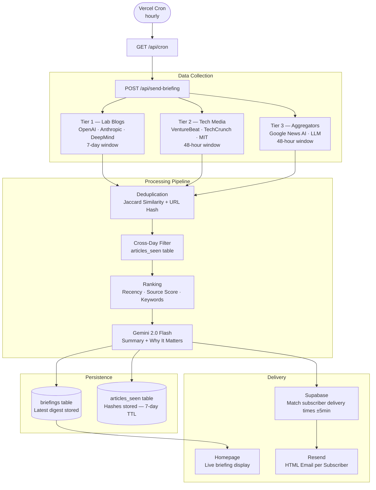

<div align="center">

<h1>Xanthra Horizon</h1>

<p><strong>A self-hosted AI intelligence pipeline that fetches, deduplicates, ranks, and delivers the most important AI developments directly to your subscribers' inboxes — every day, on their schedule.</strong></p>

<br/>

<p>
  <a href="https://nextjs.org"></a>
  <a href="https://www.typescriptlang.org"></a>
  <a href="https://supabase.com"></a>
  <a href="https://resend.com"></a>
  <a href="https://aistudio.google.com"></a>
  <a href="https://vercel.com"></a>
</p>

<p>
  
  
  
  
  
</p>

<br/>

**[Live Demo](https://xanthrahorizon.vercel.app)** · **[Report a Bug](https://github.com/professyzenith/XanthraHorizon/issues)** · **[Request a Feature](https://github.com/professyzenith/XanthraHorizon/issues)**

</div>

---

## Why This Exists

The AI landscape produces dozens of significant developments every day across research labs, product releases, and policy decisions. Following it requires constant monitoring of multiple sources — and without curation, the signal drowns in noise.

Xanthra Horizon solves this with a fully automated pipeline: it ingests from 8 curated sources across three quality tiers, removes duplicate coverage using Jaccard similarity and URL hashing, scores articles by source authority, recency, and AI keyword density, then feeds the top seven stories to Google Gemini for concise summarization and impact analysis. The resulting digest is stored and delivered to each subscriber at exactly the time they selected, converted to their local timezone.

Everything runs on free-tier infrastructure. There is no paid service requirement.

---

## Table of Contents

- [Features](#features)
- [Architecture](#architecture)
- [Tech Stack](#tech-stack)
- [Screenshots](#screenshots)
- [Live Demo](#live-demo)
- [Installation](#installation)
- [Environment Variables](#environment-variables)
- [Local Development](#local-development)
- [Production Deployment](#production-deployment)
- [Folder Structure](#folder-structure)
- [Pipeline Workflow](#pipeline-workflow)
- [API Reference](#api-reference)
- [Database Schema](#database-schema)
- [Unsubscribe Flow](#unsubscribe-flow)
- [News Sources](#news-sources)
- [Performance](#performance)
- [Security](#security)
- [Accessibility](#accessibility)
- [Roadmap](#roadmap)
- [Contributing](#contributing)
- [License](#license)
- [Acknowledgements](#acknowledgements)
- [FAQ](#faq)
- [Contact](#contact)

---

## Features

| Feature | Description |
|---|---|
| **8 Curated Sources** | Three-tier source hierarchy: lab blogs (OpenAI, Anthropic, DeepMind), tech media (VentureBeat, TechCrunch, MIT Tech Review), and aggregators (Google News AI + LLM feeds) |
| **Smart Deduplication** | Jaccard coefficient similarity across titles plus SHA-256 URL hashing — no story appears twice within a session or across days |
| **Relevance Ranking** | Composite score from source tier weight, recency decay curve, and AI keyword density |
| **Gemini Summarization** | Each of the top seven stories receives a concise summary and a "Why It Matters" analysis generated by Google Gemini 2.0 Flash |
| **Timezone-Aware Delivery** | Subscribers choose their delivery time once. The pipeline runs hourly and matches each subscriber's local time within a ±5-minute window |
| **Live Website Display** | The homepage displays the most recent briefing fetched from the database in real time — transitions from a static preview to live content once data loads |
| **HMAC-Signed Unsubscribe** | Every email contains a one-click unsubscribe URL signed with HMAC-SHA256. No login required. CAN-SPAM and GDPR-aware |
| **Zero Infrastructure Cost** | Supabase free tier · Resend 3,000 emails/month free · Gemini 1,500 requests/day free · Vercel Hobby |

---

## Architecture



The cron trigger is separated from the pipeline (`/api/cron` → `/api/send-briefing`) so the pipeline can also be invoked directly for testing and administrative use.

---

## Tech Stack

| Layer | Technology | Version | Rationale |
|---|---|---|---|
| Framework | Next.js App Router | 16.x | API routes, server components, and SSR in a single project |
| Language | TypeScript | 5.x strict | End-to-end type safety across the pipeline and UI |
| Styling | Tailwind CSS | 3.4 | Zero-runtime utility CSS; consistent dark-mode theming |
| Database | Supabase (PostgreSQL) | — | Row Level Security, free tier, real-time subscriptions available |
| Email | Resend | 3.x | Reliable transactional email; 3,000 messages/month on free tier |
| AI | Google Gemini 2.0 Flash | v1beta | 1,500 free requests/day; fast inference for daily summarization |
| Hosting | Vercel Hobby | — | Zero-config Next.js deployment; integrated cron scheduling |
| Linting | ESLint | 9.x (flat config) | Modern flat configuration with Next.js core-web-vitals ruleset |

---

## Screenshots

> **Homepage — Live Briefing Preview**


> **Email Digest**


> **Subscription Confirmation**


---

## Live Demo

**Production:** [https://xanthrahorizon.vercel.app](https://xanthrahorizon.vercel.app)

The homepage displays the most recent AI briefing in real time. The `LIVE` indicator in the upper-right of the preview card confirms that live database content has loaded. `PREVIEW` indicates the database has not yet been seeded by a pipeline run.

---

## Installation

### Prerequisites

- **Node.js** 18 or later
- **npm** 9 or later
- [Supabase](https://supabase.com) account (free)
- [Resend](https://resend.com) account (free)
- [Google AI Studio](https://aistudio.google.com) API key (free)

### Clone and Install

```bash
git clone https://github.com/professyzenith/XanthraHorizon.git
cd XanthraHorizon
npm install
```

### Initialize the Database

1. Open your Supabase project → **SQL Editor**
2. Run the contents of `supabase/schema.sql`

This creates the `subscribers`, `articles_seen`, and `briefings` tables with Row Level Security policies applied.

---

## Environment Variables

Copy the example file and fill in all values before starting the server.

```bash
cp .env.example .env.local
```

| Variable | Required | Description |
|---|---|---|
| `NEXT_PUBLIC_SUPABASE_URL` | Yes | Supabase project URL — safe to expose client-side |
| `NEXT_PUBLIC_SUPABASE_ANON_KEY` | Yes | Supabase anon key — safe to expose client-side |
| `SUPABASE_SERVICE_ROLE_KEY` | Yes | Service role key — **server-only, never expose publicly** |
| `RESEND_API_KEY` | Yes | Resend API key for email delivery |
| `RESEND_FROM_EMAIL` | Yes | Verified sender address in your Resend account |
| `GEMINI_API_KEY` | Yes | Google Gemini API key from AI Studio |
| `CRON_SECRET` | Yes | Random 32-character string protecting the pipeline endpoint |
| `NEXT_PUBLIC_APP_URL` | Yes | Full URL of your deployment (e.g. `https://xanthrahorizon.vercel.app`) |

```env
# Supabase
NEXT_PUBLIC_SUPABASE_URL=https://your-project.supabase.co
NEXT_PUBLIC_SUPABASE_ANON_KEY=your-anon-key
SUPABASE_SERVICE_ROLE_KEY=your-service-role-key

# Resend
RESEND_API_KEY=re_your_key
RESEND_FROM_EMAIL=hello@yourdomain.com

# Gemini
GEMINI_API_KEY=your-gemini-key

# Security
CRON_SECRET=your-random-32-char-string

# App
NEXT_PUBLIC_APP_URL=http://localhost:3000
```

---

## Local Development

```bash
npm run dev
```

Verify your environment is configured correctly:

```bash
curl http://localhost:3000/api/status \
  -H "Authorization: Bearer YOUR_CRON_SECRET"
```

A successful response confirms all required environment keys are present and non-placeholder.

**Dry-run the pipeline without sending emails:**

```bash
# Skip AI call — returns ranked headlines only (fastest)
curl "http://localhost:3000/api/test-pipeline?skip_ai=1" \
  -H "Authorization: Bearer YOUR_CRON_SECRET"

# Full pipeline including Gemini summarization
curl "http://localhost:3000/api/test-pipeline" \
  -H "Authorization: Bearer YOUR_CRON_SECRET"
```

---

## Production Deployment

### Vercel (Recommended)

1. Push your repository to GitHub
2. Import the project at [vercel.com/new](https://vercel.com/new)
3. Add all environment variables under **Settings → Environment Variables**
4. Set `NEXT_PUBLIC_APP_URL` to your Vercel deployment URL
5. Deploy

The `vercel.json` in this repository configures the cron schedule automatically. On **Vercel Pro**, the hourly cron runs natively. On **Vercel Hobby**, use [cron-job.org](https://cron-job.org) (free) to POST to `/api/send-briefing` every hour with the `Authorization: Bearer YOUR_CRON_SECRET` header.

### Function Timeouts

The pipeline and test routes are configured with a 60-second maximum duration in `vercel.json`:

```json
{
  "functions": {
    "app/api/send-briefing/route.ts": { "maxDuration": 60 },
    "app/api/test-pipeline/route.ts": { "maxDuration": 60 }
  }
}
```

If your Gemini calls consistently approach this limit, consider switching to Gemini Flash's streaming endpoint or reducing the number of stories summarized per run.

---

## Folder Structure

```
xanthra-horizon/
│
├── app/
│   ├── api/
│   │   ├── cron/                 GET  /api/cron               Vercel cron trigger
│   │   ├── send-briefing/        POST /api/send-briefing      Full pipeline (auth required)
│   │   ├── latest-briefing/      GET  /api/latest-briefing    Latest briefing (public, cached)
│   │   ├── subscribe/            POST /api/subscribe           Subscriber registration
│   │   ├── unsubscribe/          GET  /api/unsubscribe         HMAC-verified unsubscribe
│   │   ├── unsubscribe-by-email/ GET  /api/unsubscribe-by-email Direct email unsubscribe
│   │   ├── test-pipeline/        GET  /api/test-pipeline       Dry-run pipeline (auth required)
│   │   └── status/               GET  /api/status              Environment health check (auth required)
│   │
│   ├── privacy/                  Privacy Policy page
│   ├── tos/                      Terms of Service page
│   ├── unsubscribe/              Unsubscribe confirmation UI
│   ├── globals.css
│   ├── layout.tsx                Root layout, metadata, fonts
│   ├── page.tsx                  Landing page
│   └── sitemap.ts                Sitemap generation
│
├── components/
│   ├── InteractiveBriefing.tsx   Live briefing display (fetches /api/latest-briefing)
│   ├── SubscribeForm.tsx         Subscription form with time/timezone picker
│   ├── CommandCenter.tsx         Admin control interface
│   ├── AnimatedTimeline.tsx      Timeline UI component
│   ├── FloatingParticles.tsx     Background canvas animation
│   ├── HorizonReveal.tsx         Scroll-reveal animation wrapper
│   ├── NetworkOrb.tsx            Animated network visualization
│   ├── SignatureSection.tsx      Footer signature block
│   └── StaggerChildren.tsx       Staggered animation utility
│
├── lib/
│   ├── newsFetcher.ts            8-source RSS ingestion pipeline
│   ├── deduplicator.ts           Jaccard similarity + SHA-256 URL hash dedup
│   ├── ranker.ts                 Article scoring (source tier, recency, keywords)
│   ├── summarizer.ts             Google Gemini 2.0 Flash integration
│   ├── emailSender.ts            Resend HTML email — welcome + briefing templates
│   ├── unsubscribeToken.ts       HMAC-SHA256 signed token generation and verification
│   └── supabase.ts               Anon client (browser) + Admin client (server)
│
├── supabase/
│   └── schema.sql                Full database schema with RLS policies
│
├── types/
│   └── index.ts                  Shared TypeScript interfaces
│
├── public/
│   └── robots.txt
│
├── .env.example                  Environment variable template
├── eslint.config.mjs             ESLint v9 flat configuration
├── next.config.js                Security headers + Next.js configuration
├── vercel.json                   Cron schedule + function timeouts
└── tsconfig.json                 TypeScript strict configuration
```

---

## Pipeline Workflow

Each hourly cron invocation executes the following steps:

```
1. FETCH
   └── Parallel RSS ingestion from 8 sources across 3 tiers
       Tier 1 (7-day window): OpenAI Blog, Anthropic, DeepMind
       Tier 2 (48h window):   VentureBeat, TechCrunch, MIT Tech Review
       Tier 3 (48h window):   Google News AI, Google News LLM

2. DEDUPLICATE (within-batch)
   └── Jaccard coefficient on title n-grams (threshold: 0.6)
   └── SHA-256 URL hash exact match

3. CROSS-DAY DEDUPLICATE
   └── Query articles_seen table for hashes already delivered
   └── Fallback to full batch if fewer than 5 articles remain

4. RANK
   └── Composite score: source_tier_weight × recency_decay × keyword_density
   └── Select top 7 articles

5. SUMMARIZE
   └── Gemini 2.0 Flash generates summary + "Why It Matters" per story
   └── Executive brief generated for the full digest

6. PERSIST
   └── Insert briefing into briefings table (date, executive_brief, stories[])
   └── Upsert top-7 hashes into articles_seen (prevents re-delivery)

7. DELIVER
   └── Query subscribers WHERE is_active = true
   └── Filter by delivery_time ±5 minutes against subscriber's local timezone
   └── Send HTML email via Resend to each matched subscriber
```

---

## API Reference

All endpoints return JSON. Authentication uses `Authorization: Bearer <CRON_SECRET>` where required.

### Public Endpoints

| Endpoint | Method | Description |
|---|---|---|
| `POST /api/subscribe` | `POST` | Register a subscriber. Body: `{ email, delivery_time, timezone }` |
| `GET /api/unsubscribe` | `GET` | Deactivate a subscriber. Params: `id`, `token` (HMAC-signed) |
| `GET /api/latest-briefing` | `GET` | Return the most recent briefing from the database. Cached 5 min at the edge. |

### Protected Endpoints

All require `Authorization: Bearer <CRON_SECRET>`.

| Endpoint | Method | Description |
|---|---|---|
| `GET /api/cron` | `GET` | Vercel cron entry point — calls `/api/send-briefing` |
| `POST /api/send-briefing` | `POST` | Run the full pipeline: fetch → summarize → persist → email |
| `GET /api/test-pipeline` | `GET` | Dry-run pipeline with optional `?skip_ai=1`. No emails sent, no DB writes. |
| `GET /api/status` | `GET` | Reports which environment variables are configured and subscriber count. |

**Subscribe example:**

```bash
curl -X POST https://xanthrahorizon.vercel.app/api/subscribe \
  -H "Content-Type: application/json" \
  -d '{"email":"you@example.com","delivery_time":"08:00","timezone":"Asia/Kolkata"}'
```

**Trigger pipeline manually:**

```bash
curl -X POST https://xanthrahorizon.vercel.app/api/send-briefing \
  -H "Authorization: Bearer YOUR_CRON_SECRET"
```

---

## Database Schema

### `subscribers`

| Column | Type | Description |
|---|---|---|
| `id` | `uuid` | Primary key, auto-generated |
| `email` | `text` | Subscriber email address (unique) |
| `delivery_time` | `text` | Preferred delivery time in `HH:MM` 24-hour format |
| `timezone` | `text` | IANA timezone string (e.g. `Asia/Kolkata`) |
| `is_active` | `boolean` | False after unsubscribe |
| `created_at` | `timestamptz` | Registration timestamp |

### `articles_seen`

| Column | Type | Description |
|---|---|---|
| `hash` | `text` | SHA-256 of the article URL (unique, primary key) |
| `title` | `text` | Article headline |
| `url` | `text` | Original article URL |
| `source` | `text` | Source name |
| `created_at` | `timestamptz` | When first seen — used for 7-day TTL cleanup |

### `briefings`

| Column | Type | Description |
|---|---|---|
| `id` | `bigint` | Auto-increment primary key |
| `date` | `text` | Briefing date string |
| `executive_brief` | `text` | One-paragraph overview generated by Gemini |
| `stories` | `jsonb` | Array of `RankedStory` objects (title, url, source, summary, why_it_matters) |
| `created_at` | `timestamptz` | Pipeline run timestamp — ordered descending to serve latest |

**Row Level Security:** All tables have RLS enabled. `subscribers` and `articles_seen` are server-only (service role key required). `briefings` allows public SELECT for homepage display.

---

## Unsubscribe Flow

Every delivery email contains an unsubscribe link of the form:

```
https://yourdomain.com/unsubscribe?id={subscriber_uuid}&token={hmac_signature}
```

The token is an HMAC-SHA256 signature of the subscriber ID using `CRON_SECRET` as the key. On click:

1. `/api/unsubscribe` receives `id` and `token`
2. The server recomputes the expected HMAC and compares using timing-safe equality
3. If valid, `is_active` is set to `false` in the `subscribers` table
4. The user is redirected to the `/unsubscribe` confirmation page

Tokens are not time-limited by default. No database state is required to validate them — verification is purely cryptographic.

---

## News Sources

| Source | Tier | Freshness Window | Coverage |
|---|---|---|---|
| OpenAI Blog | Primary | 7 days | Model releases, product announcements |
| Anthropic Blog | Primary | 7 days | Safety research, Claude updates |
| Google DeepMind | Primary | 7 days | Research publications, product releases |
| VentureBeat AI | Media | 48 hours | Startup funding, enterprise AI |
| TechCrunch AI | Media | 48 hours | Product launches, acquisitions |
| MIT Technology Review | Media | 48 hours | Research analysis, policy coverage |
| Google News — AI | Aggregator | 48 hours | Broad AI landscape |
| Google News — LLM | Aggregator | 48 hours | Large language model developments |

Tier 1 sources use a 7-day ingestion window because official lab blogs publish on weekly cadences. Tier 2 and 3 sources use 48-hour windows to maintain freshness and minimize stale content in the ranked pool.

---

## Performance

**API Response Caching**

`GET /api/latest-briefing` is served with:

```
Cache-Control: public, s-maxage=300, stale-while-revalidate=600
```

This instructs Vercel's CDN to cache the briefing for 5 minutes and serve stale content for up to 10 minutes while revalidating in the background. The homepage never blocks on a database round-trip for returning visitors.

**Homepage Strategy**

`InteractiveBriefing` renders static demo content immediately on mount (zero layout shift), then fetches live data from `/api/latest-briefing` in a background `useEffect`. Once the API responds, the component swaps to real content without re-mounting. The LIVE/PREVIEW indicator in the header communicates content status to the user.

**Pipeline Parallelism**

All 8 RSS feeds are fetched concurrently using `Promise.allSettled`. Individual source failures do not block the pipeline — they are logged and the remaining sources continue.

---

## Security

| Control | Implementation |
|---|---|
| **Pipeline authentication** | All pipeline endpoints require `Authorization: Bearer <CRON_SECRET>` — a 32-character secret stored as an environment variable |
| **HMAC unsubscribe tokens** | Unsubscribe URLs are signed with HMAC-SHA256. Forged or tampered tokens are rejected |
| **Row Level Security** | RLS is enabled on all Supabase tables. The service role key is server-only and never exposed to the browser |
| **Content Security Policy** | Strict CSP header set in `next.config.js` — restricts script, style, font, image, and connection sources |
| **HSTS** | `Strict-Transport-Security: max-age=63072000; includeSubDomains; preload` |
| **X-Frame-Options** | `DENY` — prevents clickjacking |
| **Referrer Policy** | `strict-origin-when-cross-origin` |
| **Permissions Policy** | Camera, microphone, geolocation, and payment APIs explicitly disabled |
| **No debug endpoints in production** | Test and status endpoints are protected by the same `CRON_SECRET`. The `/api/test-email` endpoint was removed from the production codebase |
| **Supabase function search path** | The `update_updated_at` trigger function is defined with `SET search_path = ''` to prevent schema injection. Execute permissions are revoked from `public`, `anon`, and `authenticated` roles |

---

## Accessibility

- Semantic HTML5 elements throughout (`main`, `section`, `article`, `nav`, `header`, `footer`)
- Single `<h1>` per page with a clear heading hierarchy
- All interactive elements have accessible labels and focus states
- Color contrast ratios meet WCAG AA standards in the dark-mode design
- External links include `rel="noreferrer"` and open in new tabs with visible indicators
- Motion-sensitive animations are contained to canvas elements and can be reduced by browser `prefers-reduced-motion` media query
- Form inputs are labeled and include descriptive `placeholder` text

---

## Roadmap

Ordered by priority. Community contributions are welcome on any of these.

- [ ] **Subscriber dashboard** — Web interface for managing delivery time, timezone, and preferences without re-subscribing
- [ ] **Weekly digest mode** — Friday summary of the week's top 15 stories for subscribers who prefer lower frequency
- [ ] **Topic filtering** — Let subscribers choose categories (Research / Product / Policy / Business) to include or exclude
- [ ] **RSS output** — Machine-readable RSS feed of each Xanthra Horizon edition
- [ ] **GitHub Actions cron** — Alternative to Vercel cron for full Hobby plan compatibility without external services
- [ ] **Open Graph per edition** — Auto-generated OG image for each daily briefing (shareable on social)
- [ ] **7-day article cleanup job** — Automated cron to purge `articles_seen` rows older than 7 days
- [ ] **Multi-language support** — Localized briefings using Gemini's multilingual output
- [ ] **Engagement tracking** — Optional click-through tracking for individual story links

---

## Contributing

Contributions are welcome. Please read this section before opening a pull request.

**Good first issues:**
- Adding a new high-quality RSS source to `lib/newsFetcher.ts`
- Improving the ranking algorithm in `lib/ranker.ts`
- Bug fixes with reproduction steps
- Documentation improvements

**Process:**

```bash
# 1. Fork the repository and clone your fork
git clone https://github.com/YOUR_USERNAME/XanthraHorizon.git

# 2. Create a feature branch
git checkout -b feat/your-feature-name

# 3. Make your changes with conventional commit messages
git commit -m "feat: add Reuters AI source to news fetcher"

# 4. Push and open a pull request against main
git push origin feat/your-feature-name
```

**Commit convention:**

| Prefix | Use |
|---|---|
| `feat:` | New feature |
| `fix:` | Bug fix |
| `refactor:` | Code change that is not a feature or fix |
| `docs:` | Documentation only |
| `chore:` | Build, tooling, or dependency updates |
| `security:` | Security-related change |

All pull requests must pass TypeScript compilation (`npx tsc --noEmit`) and ESLint (`npx eslint app lib components`).

---

## License

[MIT](./LICENSE) — You are free to use, fork, modify, and deploy this project for any purpose.

---

## Acknowledgements

- [Next.js](https://nextjs.org) — The React framework this project is built on
- [Supabase](https://supabase.com) — Open source Firebase alternative that powers the database
- [Resend](https://resend.com) — Modern email infrastructure for developers
- [Google Gemini](https://aistudio.google.com) — AI summarization backbone
- [Vercel](https://vercel.com) — Deployment and edge infrastructure
- [Tailwind CSS](https://tailwindcss.com) — Styling system
- [rss-parser](https://github.com/rbren/rss-parser) — RSS feed parsing library

---

## FAQ

<details>
<summary><strong>Why is email going to spam?</strong></summary>

The default sender address `onboarding@resend.dev` is a shared Resend sandbox domain. All email from this address is likely to land in spam. To fix this:

1. Register a domain and add it to your Resend account under **Domains**
2. Add the required DNS records (DKIM, SPF, DMARC)
3. Update `RESEND_FROM_EMAIL` to an address on your verified domain

Until a custom domain is configured, ask subscribers to mark the email as "Not Spam" or add your sender address to their contacts.

</details>

<details>
<summary><strong>How do I trigger the pipeline manually?</strong></summary>

```bash
curl -X POST https://xanthrahorizon.vercel.app/api/send-briefing \
  -H "Authorization: Bearer YOUR_CRON_SECRET"
```

This runs the full pipeline and saves the briefing to the database, but only sends emails to subscribers whose delivery time matches the current time (±5 minutes).

To run a dry-run with no emails and no database writes:

```bash
curl "https://xanthrahorizon.vercel.app/api/test-pipeline?skip_ai=1" \
  -H "Authorization: Bearer YOUR_CRON_SECRET"
```

</details>

<details>
<summary><strong>What happens if Gemini is unavailable?</strong></summary>

The summarizer (`lib/summarizer.ts`) throws if the Gemini API key is missing or if the API returns a non-200 response. The pipeline will fail at step 5 and return a 500 error. No emails are sent and no database writes occur. The previous briefing remains displayed on the homepage.

To make the pipeline resilient to AI failures, consider adding a fallback that returns raw headlines without summaries.

</details>

<details>
<summary><strong>How does the timezone matching work?</strong></summary>

Each subscriber stores their preferred delivery time as `HH:MM` in 24-hour format and their IANA timezone string (e.g. `America/New_York`). When the pipeline runs, it uses `Intl.DateTimeFormat` to convert the current UTC time into each subscriber's local time and checks whether it falls within a ±5-minute window of their preferred delivery time. Subscribers outside this window are skipped until the cron runs again in the next hour.

</details>

<details>
<summary><strong>Why does the homepage show "PREVIEW" instead of "LIVE"?</strong></summary>

The `briefings` table is empty until the pipeline runs for the first time. Once you trigger `/api/send-briefing` or the hourly cron executes, the briefing is saved to the database and the homepage will switch to "LIVE" automatically on the next page load.

</details>

<details>
<summary><strong>Can I add more news sources?</strong></summary>

Yes. Open `lib/newsFetcher.ts` and add a new entry to the relevant tier array. Each source requires an RSS feed URL and a freshness window in hours. The deduplication and ranking pipeline handles the rest automatically.

</details>

---

## Contact

**Pratik Jha** — [@professyzenith](https://github.com/professyzenith) — `professy69@gmail.com`

**Repository:** [https://github.com/professyzenith/XanthraHorizon](https://github.com/professyzenith/XanthraHorizon)

**Live:** [https://xanthrahorizon.vercel.app](https://xanthrahorizon.vercel.app)

---

<div align="center">

Built with Next.js · Supabase · Resend · Google Gemini · Vercel

</div>
