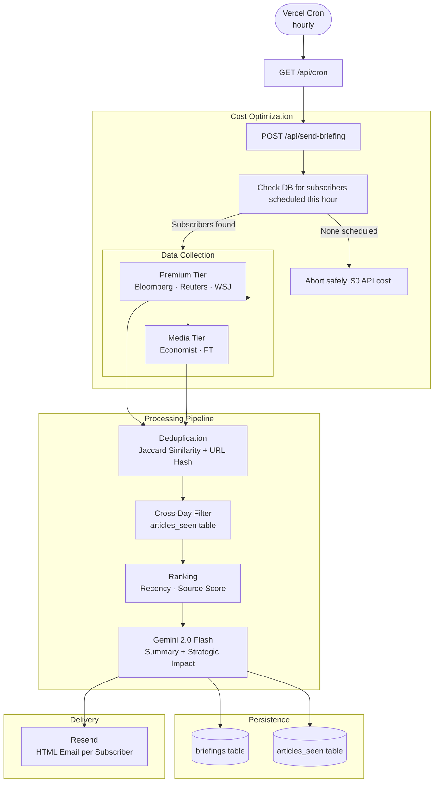

<div align="center">


<a href="https://github.com/professyzenith/XanthraHorizon">
  
</a>

<br/><br/>

<p>
  <a href="https://nextjs.org"></a>
  <a href="https://www.typescriptlang.org"></a>
  <a href="https://supabase.com"></a>
  <a href="https://resend.com"></a>
  <a href="https://aistudio.google.com"></a>
  <a href="https://vercel.com"></a>
</p>

<p>
  
  
  
  
  
  
</p>

<br/>

**[Live Demo](https://www.xanthra.space)** · **[Report a Bug](https://github.com/professyzenith/XanthraHorizon/issues)** · **[CHANGELOG](./CHANGELOG.md)** · **[Contributing](./CONTRIBUTING.md)**

[](https://vercel.com/new/clone?repository-url=https%3A%2F%2Fgithub.com%2Fprofessyzenith%2FXanthraHorizon&env=NEXT_PUBLIC_SUPABASE_URL,NEXT_PUBLIC_SUPABASE_ANON_KEY,SUPABASE_SERVICE_ROLE_KEY,RESEND_API_KEY,RESEND_FROM_EMAIL,GEMINI_API_KEY,CRON_SECRET,NEXT_PUBLIC_APP_URL,GOOGLE_CLIENT_ID,GOOGLE_CLIENT_SECRET,NEXTAUTH_SECRET,NEXTAUTH_URL&envDescription=See%20README%20%E2%86%92%20Environment%20Variables%20for%20details&project-name=xanthra-horizon&repository-name=XanthraHorizon)

</div>

---

## The Strategic Gap

> **Stop reading 12 tabs of news. Get one perfectly crafted email.**

The world moves incredibly fast. Geopolitics, global markets, technology, and regulatory policies are experiencing synchronized shifts every single day. Following it all requires constant monitoring of multiple premium sources — and without aggressive curation, the signal completely drowns in the noise.

I built **Xanthra Horizon** to solve this. It's a fully automated, elite-tier intelligence pipeline. 

Instead of you hunting for news, Xanthra Horizon wakes up every hour, checks if it's your preferred delivery time, and then independently crawls the world's top premium sources (Bloomberg, Reuters, AP News, Wall Street Journal). It removes duplicate coverage using mathematical similarity algorithms, scores the articles by source authority and recency, and then feeds the absolute top seven global stories to Google Gemini for concise summarization and **Strategic Impact** analysis.

The result is a meticulously curated, high-signal intelligence brief that cuts through the noise—delivered directly to your inbox for exactly $0.


## Table of Contents

- [Quick Start](#quick-start)
- [Features That Matter](#features-that-matter)
- [Architecture](#architecture)
- [Tech Stack](#tech-stack)
- [Zero Infrastructure Cost](#zero-infrastructure-cost)
- [Installation](#installation)
- [Environment Variables](#environment-variables)
- [Local Development](#local-development)
- [Production Deployment](#production-deployment)
- [Pipeline Workflow](#pipeline-workflow)
- [Database Schema](#database-schema)
- [Security & Spam Protection](#security--spam-protection)
- [Contributing](#contributing)

---

## Quick Start

> Requires Node.js 18+, a Supabase project, a Resend account, and a Google Gemini API key. All free.

```bash
# 1. Clone and install
git clone https://github.com/professyzenith/XanthraHorizon.git
cd XanthraHorizon && npm install

# 2. Configure environment
cp .env.example .env.local
# Edit .env.local with your keys (see Environment Variables below)

# 3. Initialize the database
# Open Supabase SQL Editor and run supabase/schema.sql

# 4. Verify your setup
curl http://localhost:3000/api/status \
  -H "Authorization: Bearer YOUR_CRON_SECRET"

# 5. Trigger your first briefing
curl -X POST http://localhost:3000/api/send-briefing \
  -H "Authorization: Bearer YOUR_CRON_SECRET"
```

---

## Features That Matter

| Feature | What it actually does |
|---|---|
| **Premium Sourcing** | Crawls high-signal sources like Reuters, Bloomberg, AP News, and WSJ. No low-effort blogs. |
| **Smart Deduplication** | Uses Jaccard coefficient similarity plus URL hashing. You will never see the same story twice across different days. |
| **Gemini AI Synthesis** | Each of the top seven stories gets a concise summary and a dedicated "Strategic Impact" analysis generated by Gemini. |
| **Timezone-Aware Delivery** | You pick the exact time you want your email (e.g., 7:00 AM IST). The system wakes up hourly, checks who needs an email, and sends it exactly when requested. |
| **Google Auth Spam Protection** | Bots ruin mailing lists. Xanthra Horizon uses Google Sign-In for subscribers, ensuring 100% verified human emails. |
| **Cost-Optimized Cron** | The pipeline runs every hour, but safely aborts *before* calling the AI if no users are scheduled for that hour. This saves massive API costs. |
| **HMAC-Signed Unsubscribe** | One-click unsubscribe URLs signed with HMAC-SHA256. No login required, highly secure. |

---

## Architecture


```mermaid
flowchart TD
    CRON([Vercel Cron\nhourly]) --> CRONAPI[GET /api/cron]
    CRONAPI --> PIPELINE[POST /api/send-briefing]

    subgraph PRECHECK ["Cost Optimization"]
        PIPELINE --> CHECK[Check DB for subscribers scheduled this hour]
        CHECK -->|None scheduled| ABORT[Abort safely. $0 API cost.]
        CHECK -->|Subscribers found| FETCH
    end

    subgraph FETCH ["Data Collection"]
        FETCH --> T1[Premium Tier\nBloomberg · Reuters · WSJ]
        FETCH --> T2[Media Tier\nEconomist · FT]
    end

    subgraph PROCESS ["Processing Pipeline"]
        T1 & T2 --> DEDUP[Deduplication\nJaccard Similarity + URL Hash]
        DEDUP --> CROSSDAY[Cross-Day Filter\narticles_seen table]
        CROSSDAY --> RANK[Ranking\nRecency · Source Score]
        RANK --> GEMINI[Gemini 2.0 Flash\nSummary + Strategic Impact]
    end

    subgraph PERSIST ["Persistence"]
        GEMINI --> BRIEFINGDB[(briefings table)]
        GEMINI --> SEENDB[(articles_seen table)]
    end

    subgraph DELIVER ["Delivery"]
        GEMINI --> RESEND[Resend\nHTML Email per Subscriber]
    end
```

---

## Tech Stack

I built this with modern, scalable tools that are a joy to work with:

- **Framework:** Next.js (App Router)
- **Language:** TypeScript (Strict Mode)
- **Styling:** Tailwind CSS (Dark Mode, Glassmorphism, Micro-animations)
- **Database:** Supabase (PostgreSQL with Row Level Security)
- **Email:** Resend (React-based HTML templates)
- **AI:** Google Gemini 2.0 Flash
- **Auth:** NextAuth (Google Provider)
- **Hosting:** Vercel

---

## Zero Infrastructure Cost

Running a daily AI platform usually gets expensive quickly. I engineered this to run entirely on free tiers. 

| Service | Free Tier Limit | Usage in This Project |
|---|---|---|
| **Supabase** | 500 MB database | 3 small tables, grows at ~1 row/day |
| **Resend** | 3,000 emails/month | 1 email per subscriber per day |
| **Google Gemini** | 1,500 requests/day | Max 24 requests per day (1 per hour) |
| **Vercel** | Unlimited deployments | Static site + hourly cron |

**How the AI cost stays at $0:** Even if 1,000 people subscribe for a 7:00 PM delivery, the system makes **exactly one** API call to Gemini at 7:00 PM. It then takes that single AI-generated briefing and emails it to all 1,000 users. It scales infinitely without multiplying your AI costs.

---

## Installation & Deployment

### 1. Database Setup (Supabase)
1. Create a free Supabase project.
2. Go to the SQL Editor and paste the contents of `supabase/schema.sql`.
3. This creates the `subscribers`, `articles_seen`, and `briefings` tables with all the necessary Row Level Security (RLS) policies.

### 2. Google OAuth Setup (For Spam Protection)
1. Go to Google Cloud Console and create a new project.
2. Go to APIs & Services -> Credentials -> Create OAuth client ID (Web application).
3. Add your callback URL: `https://your-domain.com/api/auth/callback/google`
4. Copy the Client ID and Client Secret.

### 3. Vercel Deployment
Deploying to Vercel is the easiest way to run this because it natively supports the hourly cron job configured in `vercel.json`.

1. Push your repository to GitHub.
2. Import the project in Vercel.
3. Add the environment variables below.
4. Hit Deploy!

---

## Environment Variables

Copy `.env.example` to `.env.local` and fill these in:

| Variable | Description |
|---|---|
| `NEXT_PUBLIC_SUPABASE_URL` | Supabase project URL |
| `NEXT_PUBLIC_SUPABASE_ANON_KEY` | Supabase anon key |
| `SUPABASE_SERVICE_ROLE_KEY` | Service role key — **server-only, never expose publicly** |
| `RESEND_API_KEY` | Resend API key for email delivery |
| `RESEND_FROM_EMAIL` | Verified sender address in your Resend account |
| `GEMINI_API_KEY` | Google Gemini API key |
| `CRON_SECRET` | A random 32-character string you invent to protect your pipeline endpoint |
| `NEXT_PUBLIC_APP_URL` | Your website URL (e.g. `https://www.xanthra.space`) |
| `GOOGLE_CLIENT_ID` | From Google Cloud Console |
| `GOOGLE_CLIENT_SECRET` | From Google Cloud Console |
| `NEXTAUTH_SECRET` | A random password to encrypt user sessions |
| `NEXTAUTH_URL` | Your website URL (e.g. `https://www.xanthra.space`) |

---

## Security & Spam Protection

Mailing lists are massive targets for bots. If you leave a simple email input field open to the internet, bots will fill your database with thousands of fake emails, which will ruin your sender reputation on Resend and get your account banned.

**How we stop it:**
Xanthra Horizon completely drops the traditional email input field. Instead, users must click **"Continue with Google"**. The backend uses NextAuth to verify the user is a real human with a real Google account. Once verified, the subscription is processed. 

This means **100% zero spam**. Every email in your Supabase database is guaranteed to be a real person.

Other security measures:
- All pipeline endpoints require `Authorization: Bearer <CRON_SECRET>`.
- Unsubscribe URLs are cryptographically signed with HMAC-SHA256. Forged tokens are instantly rejected.
- Row Level Security (RLS) is enabled on all Supabase tables.

---

## Contributing

This project is open-source and contributions are always welcome. Whether you want to add new premium RSS sources, improve the deduplication math, or tweak the UI, feel free to open a pull request!

---

## Contact & Credits

Built by **[@professyzenith](https://github.com/professyzenith)**.

If you find a bug or have a feature request, [open an issue](https://github.com/professyzenith/XanthraHorizon/issues).

<div align="center">


Built with Next.js · Supabase · Resend · Google Gemini · Vercel

</div>
